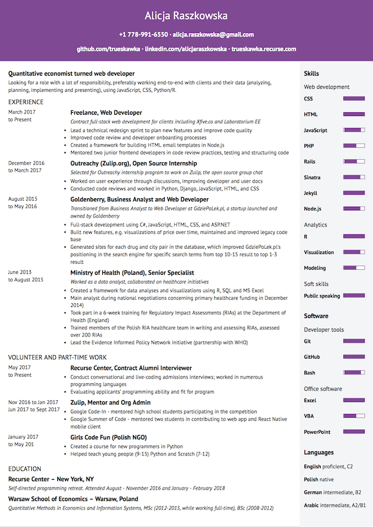

# HTML + CSS resume
Pure HTML and CSS resume using Gulp and Nunjucks.

I created this simple setup to have more fine-grained control over my resume than a text
editor would allow. Also, it's fun to set up tools!

### How to install

1. Clone repo
2. Run `npm install` in the cloned directory

### How to use

1. Add your data in `src/data/sample_data.json`. Rename it to `src/data/data.json`.
2. Adjust CSS, e.g. `$brand_color` in `src/sass/main.scss` to your preffered settings.
3. Run with `gulp`, refresh on changes.
4. Use browser printing to save as .pdf - works best in webkit browsers (e.g. Chrome, Safari).

### Example

1. Generated HTML

  I used this tool to generate my resume - I expanded the CSS and cleared some minor whitespace
  annoyances, but other than that it's what you can expect from this setup.
  https://trueskawka.github.io/resume/

2. Printed .pdf

  You can print the file and save it as .pdf - I use Chrome, because it doesn't add additional margins.

  

### What's up with...

1. ...all the additional whitespace in `nunjucks` files?

  I wanted to make sure the generated HTML is easily readable, which often requires
  the `nunjucks` partials to have some unusual whitespace choices.

2. ...images for skill levels - aren't those already created with linear gradients?

  I added images for skill levels because printing as .pdf in Chrome didn't support
  linear gradients as background. If you don't want to print the file, feel free to 
  remove the images altogether.

3. ...the compact CSS?

  I used a standard Sass option for the compact CSS output. You can change it in the
  `gulpfile` to any of the: `nested`, `expanded` or `compressed` 
  ([more info](https://web-design-weekly.com/2014/06/15/different-sass-output-styles/) 
  on the output of different options).

### License
MIT, as published by [Open Source Initiative](https://opensource.org/licenses/MIT).